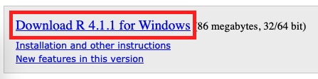
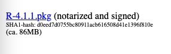
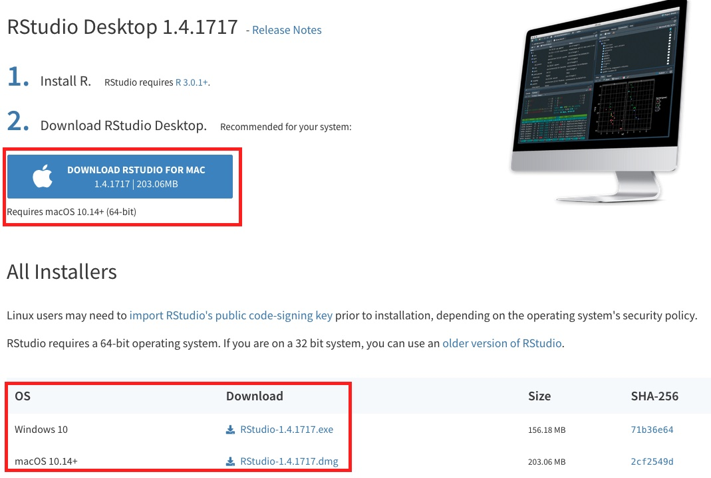
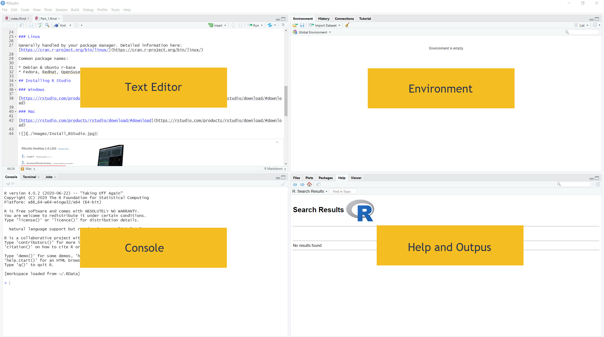

## Installing R

### Windows

[https://cran.r-project.org/bin/windows/base/](https://cran.r-project.org/bin/windows/base/)

### Mac

[https://cran.r-project.org/bin/macosx/](https://cran.r-project.org/bin/macosx/)

### Linux

Generally handled by your package manager. Detailed information here: [https://cran.r-project.org/bin/linux/](https://cran.r-project.org/bin/linux/)

Common package names:

* Debian & Ubuntu r-base
* Fedora, RedHat, OpenSuse r-core

## Installing R Studio

### Windows

[https://rstudio.com/products/rstudio/download/#download](https://rstudio.com/products/rstudio/download/#download)

### Mac

[https://rstudio.com/products/rstudio/download/#download](https://rstudio.com/products/rstudio/download/#download)

### Linux

* Debian & Ubuntu [https://rstudio.com/products/rstudio/download-server/debian-ubuntu/](https://rstudio.com/products/rstudio/download-server/debian-ubuntu/)
* Fedora & RedHat [https://www.r-studio.com/Disk_Recovery_Articles/Install_Uninstall_LinuxRpm/](https://www.r-studio.com/Disk_Recovery_Articles/Install_Uninstall_LinuxRpm/)
* OpenSuse [https://software.opensuse.org/package/rstudio](https://software.opensuse.org/package/rstudio)

## What is R

`R` is a scripted programming language. This means we use `R` - the language - to write code - or a set of instructions - in a plain text editor. This code is often written to wrangle data or run computations, such as statistical analyses, on data. R is also the name of the software used to run or execute the programs that you write in `R`.

So, R is both:

* A programming language
* The software used to run your programs

## What is RStudio

RStudio is an integrated development environment for `R`. What does this mean? RStudio is a place for you to write and view the output of what you write all in one place.

Since we write `R` in plain text, you could write an `R` script in any text editor - Notepad, Atom whatever you like. You could then have R - the software used to run your script - run your script and create an output. You could then view your output - a pdf, a csv, a webpage, an image and so on. In RStudio, you do all of this - write, process, and view - all in one place. Hence the term integrated.

RStudio is not the only IDE for `R`, but it is definitely one of the most common.

While we will be using RStudio, this is not a workshop on how to use RStudio, so we won\'t be exploring RStudio in great detail, instead, we\'ll be leveraging some of the benefits that are derived from working in an IDE.

* Integrated Development Environment (IDE)

